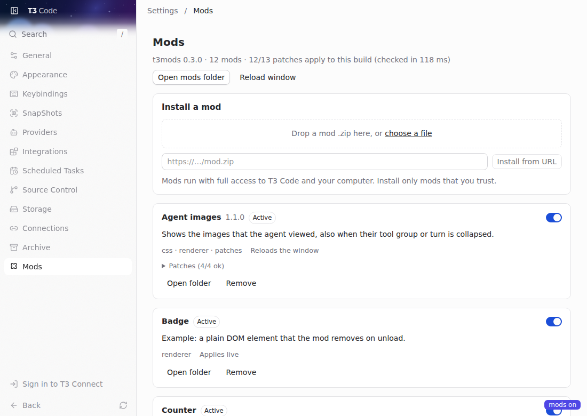

# t3code-mods

Change [T3 Code](https://github.com/pingdotgg/t3code) without keeping a fork. t3mods loads
mods into the official app: turn each one on or off, remove it, write your own on top, and share
it on the registry. Style and page-code changes apply as you save; other files reload the page
or need a restart ([table](#write-a-mod)).

**Browse, install, review and publish mods at [t3mods.jonn.cc](https://t3mods.jonn.cc).**



> Not affiliated with, endorsed by, or sponsored by T3 Code or its authors. Mods run with full
> trust, like Vencord or BetterDiscord plugins: install only mods you read or trust.

Windows and Linux (AppImage, .deb, AUR: [details](docs/linux.md)). After an app update the
loader puts itself back; a mod that patches app code can still break until it is fixed, and
`t3mods doctor` shows which patches still apply. Tested with T3 Code Nightly 0.0.46. macOS: [help wanted](https://github.com/JohnC0de/t3code-mods/issues).

## Install

```sh
git clone https://github.com/JohnC0de/t3code-mods
cd t3code-mods
./install.sh                          # Linux; no Node needed
node loader/t3mods.mjs install        # Windows; quit T3 Code first
```

No Node on Windows? Use the app's own Electron:

```powershell
$env:ELECTRON_RUN_AS_NODE=1; & "$env:LOCALAPPDATA\Programs\t3code\T3 Code (Nightly).exe" loader\t3mods.mjs install
```

The same line with `doctor` or `uninstall` in place of `install` runs those commands. On Linux
without Node, see [Linux](docs/linux.md#uninstall).

Start T3 Code (Linux AppImage: **T3 Code (mods)** in the app menu). Settings gets a **Mods**
page; mods live in `~/.t3/mods`. `node loader/t3mods.mjs uninstall` (quit T3 Code first) puts
the original app archive back. On Windows it also takes out server patches that `server-patch`
wrote into `server.asar` and removes the post-update task. Your mods in `~/.t3/mods` and the
loader copy in `~/.t3/t3mods` stay; delete them yourself if you want them gone.
[How it works](docs/architecture.md).

Below, `t3mods` means `node loader/t3mods.mjs`. `t3mods --help` lists every command.

## Get mods

- **Site:** **Open in T3 Code** on a mod page (needs the loader installed). The app always shows
  author, version, contents and sha256, and installs only after you agree.
- **App:** Settings > Mods > **Browse the registry**: search, install, update. It asks first
  when a mod (or an update) brings code that runs with full access, or when the version is
  yanked.
- **CLI:** `t3mods search <words>`, `t3mods add <id>[@version]`, `t3mods update`. `add` prints
  the same warnings and installs at once. `update` asks when an update adds full-access code
  (`--yes` accepts).

Registry installs check the archive against the sha256 that the registry lists. `t3mods add`
with a zip file or an https URL has no expected hash: it only records the sha256 of what it
installed. Full-access code is `patches.cjs`, `server.cjs`, `server-patches.cjs` and
`main.cjs`. No check makes a mod safe: read what you install.

## Write a mod

`t3mods new hello` creates `~/.t3/mods/hello` with editor types, active at once.

| File | Runs in | After you save |
|---|---|---|
| `style.css` | page | swaps in place |
| `renderer.js` | page | re-imported in place |
| `patches.cjs` | app code, as it loads | page reloads |
| `server.cjs` | backend (Node) | re-required in place |
| `server-patches.cjs` | backend code, as it loads | app restart |
| `main.cjs` | Electron main | re-required in place if it returns a cleanup, else app restart |

Read [Writing mods](docs/writing-mods.md), the [examples](examples/) and the typed API in
[`loader/types/t3mods.d.ts`](loader/types/t3mods.d.ts). Prefer the API to patches: an app update
can break a patch, and `t3mods doctor` shows which still apply.

**With an agent,** keep it away from your live app. Run it in the clone with a prompt like:

```text
Read loader/types/t3mods.d.ts and docs/writing-mods.md. Create a mod that <does X> with
`node loader/t3mods.mjs new <id> --mods ./my-mods`. Prefer the API to patches. Test it in a
separate app instance: start `node loader/t3mods.mjs dev --isolated --mods ./my-mods --cdp 9333`
in the background, then drive it over CDP on port 9333.
```

## Publish

1. Sign in with GitHub at https://t3mods.jonn.cc/login.
2. Create a publishing token at https://t3mods.jonn.cc/settings/tokens (shown once).
3. Run:

```sh
t3mods login                          # paste the token
t3mods publish ./my-mods/my-mod --changelog "What changed"
```

`mod.json` needs an `id` and a semver `version`; a `README.md` becomes the mod page. Versions are
immutable and the first publisher owns the id ([details](docs/writing-mods.md#publish-to-the-registry)).
Ask questions and propose ideas in [Discussions](https://github.com/JohnC0de/t3code-mods/discussions).

## Mods in this repo

| Mod | What it does | Install |
|---|---|---|
| [`agent-instructions`](mods/agent-instructions) | Adds your `instructions.md` to what every agent with the T3 tools gets (Claude, Codex, OpenCode, Pi, Cursor, ACP). | `t3mods add agent-instructions` |
| [`agent-images`](mods/agent-images) | Shows the images the agent viewed, also when their tool group or turn is collapsed. | `t3mods add agent-images` |
| [`clean-tools`](mods/clean-tools) | Quieter tool rows: monospace commands, dimmed thinking, failed calls in red. | `t3mods add clean-tools` |
| [`agent-inbox`](mods/agent-inbox) | An edge strip and a keyboard inbox for agent threads that work, wait for you, finish or fail. | Not on the registry yet: `t3mods pack mods/agent-inbox`, then `t3mods add` the zip. |
| [`calm-thread`](mods/calm-thread) | Finished turns read as one-line titles; open one for the prompt, a work receipt and the answer. Focus, Normal and Full density on Alt+D. | Not on the registry yet: `t3mods pack mods/calm-thread`, then `t3mods add` the zip. |
| [`find-in-thread`](mods/find-in-thread) | Ctrl+F finds and highlights text in the open thread, also in messages scrolled out of view. | Not on the registry yet: `t3mods pack mods/find-in-thread`, then `t3mods add` the zip. |
| [`html-path`](mods/html-path) | `html_preview` and `html_render` take the path of an `.html` file, so agents stop pasting whole pages as tool input. | Not on the registry yet: `t3mods pack mods/html-path`, then `t3mods add` the zip. |
| [`app-badge`](mods/app-badge) | Tells your T3 Code apps apart when you run more than one: a window title and, on Windows, a taskbar badge. | Not on the registry yet: `t3mods pack mods/app-badge`, then `t3mods add` the zip. |

## Contribute

Patch fixes after T3 Code updates help most. See [CONTRIBUTING.md](CONTRIBUTING.md) for the
checks and [AGENTS.md](AGENTS.md) for agent rules. License: [MIT](LICENSE).
